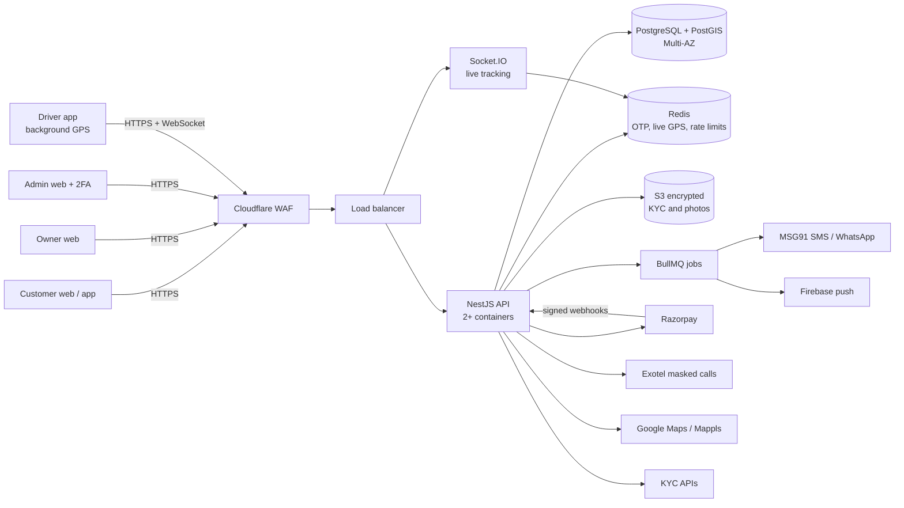

# NeerNow technology architecture

The goal is a stable, secure platform for Coimbatore that handles phone OTP login, customer contact details, online payments and live GPS tracking. It should grow city by city without a rewrite.

## Design principles

- **One language across the stack (TypeScript).** Web, mobile and server share types and validation rules, so a small team can move fast with fewer bugs.
- **Managed cloud services in India.** Use a hosted database, cache and storage in the AWS Mumbai region instead of running our own servers. Data stays in India, and backups and failover are handled for us.
- **Specialist providers for sensitive work.** Payments, SMS/OTP, masked calls and KYC checks go to regulated Indian providers. We never store card or UPI details.
- **Security by default.** Encryption, least-privilege access and audit logs are built in from day one, not added later.

## Stack at a glance

| Layer | Choice | Why |
|---|---|---|
| Customer, owner and admin web | **Next.js (React) + TypeScript** | Fast pages, good on mobile browsers, one codebase for all three portals with role-based routes |
| Driver / owner mobile app | **React Native (Expo) + TypeScript** | Android + iOS from one codebase; shares code with the web |
| Background GPS on phone | **react-native-background-geolocation** (Transistorsoft, paid licence) | Battle-tested background tracking with battery optimisation and offline buffering. Plain free libraries are unreliable on Android when the app is in the background |
| API server | **NestJS (Node.js) + TypeScript** | Structured modules, built-in guards for role checks, validation pipes, good testing support |
| Real-time | **Socket.IO** with the Redis adapter | Live tanker position to customer and admin screens; works across several servers |
| Main database | **PostgreSQL 16 + PostGIS** on **AWS RDS**, Multi-AZ | Reliable relational data (orders, payments, owners); PostGIS handles "nearest tanker" and geofence checks |
| Cache, OTP, live locations | **Redis** (AWS ElastiCache) | OTP codes with 5-minute expiry, rate limits, latest lorry position (Redis GEO), sessions |
| Background jobs | **BullMQ** on Redis | SMS sending, payout runs, document-expiry reminders, retries |
| File storage | **AWS S3** (private bucket, KMS encryption) | KYC documents, delivery photos; opened only through short-lived signed links |
| Hosting | **AWS Mumbai (ap-south-1)**: ECS Fargate containers behind a load balancer, 2 availability zones | No servers to patch, auto-scaling, keeps data in India |
| Edge protection | **Cloudflare** (or AWS CloudFront + AWS WAF) | DDoS protection, web application firewall, bot blocking, TLS |
| Maps and routing | **Google Maps Platform** or **Mappls (MapmyIndia)** | Address search, road distance, ETA. Mappls has strong Indian address data and is often cheaper |
| SMS OTP | **MSG91** (DLT-registered sender ID and templates) | TRAI DLT registration is mandatory for business SMS in India |
| WhatsApp | **Meta WhatsApp Cloud API** or **Gupshup** | Order updates and WhatsApp ordering |
| Push notifications | **Firebase Cloud Messaging** | Order requests to owners, status updates to customers |
| Masked calls | **Exotel** | Customer and driver call through a virtual number; neither sees the other's number |
| Payments | **Razorpay** (Payments + **Route** for owner payouts) | UPI, cards, netbanking; Route splits money to owners automatically. Cashfree is a good alternative |
| KYC verification | **Surepass**, **IDfy** or **Signzy** APIs | Verify driving licence and RC against government records (Sarathi/Vahan), PAN check. Use DigiLocker instead of collecting Aadhaar copies |
| Errors and monitoring | **Sentry**, **Grafana Cloud** or CloudWatch, **Better Stack** uptime | Know about crashes and slowdowns before customers complain |
| Code and delivery | **GitHub** + **GitHub Actions**, **Docker**, **Terraform** | Automatic tests and security scans on every change; repeatable infrastructure |

## How the pieces connect

## How OTP is handled safely

1. The user enters a phone number. The server checks rate limits: at most 3 OTPs per number per 10 minutes and 10 per IP per hour. It shows a CAPTCHA after repeated requests.
2. The server generates a 6-digit OTP with a cryptographically secure random generator.
3. **The OTP is never stored in plain text.** Only an HMAC-SHA256 hash is kept in Redis, with a **5-minute expiry** and an attempt counter.
4. The SMS goes through MSG91 using a DLT-approved template.
5. On verification the hashes are compared in constant time. After **5 wrong attempts** the OTP is deleted and the number is locked for 15 minutes.
6. On success the OTP is deleted immediately (single use). The server issues a 15-minute access token and a refresh token in an HttpOnly, Secure, SameSite cookie. Refresh tokens rotate on every use.
7. **Delivery OTPs** (the 4-digit code shared with the driver) follow the same rules: hashed, tied to one order, only accepted when the driver's GPS is inside the customer's geofence, and the order is paused after 3 wrong tries.
8. **Admins** also use an authenticator-app code (TOTP 2FA). Admin logins are allowed only from approved IPs or a VPN.

## How contact details and personal data are protected

| Data | Protection |
|---|---|
| Phone numbers, names, addresses | **Field-level encryption** (AES-256-GCM, keys in AWS KMS) on top of database encryption. A separate keyed hash ("blind index") lets us look up a phone number without decrypting the whole table |
| Phone numbers in the UI | Masked (`+91 98••• ••210`). Drivers and owners never see the customer's number; calls go through Exotel |
| Aadhaar | **Not stored.** Verify through DigiLocker or a KYC API and keep only the verification reference and last 4 digits |
| PAN, bank account | Encrypted; shown masked; only finance-role admins can view, and each view is logged |
| KYC documents and delivery photos | Private S3 bucket, KMS-encrypted, opened through links that expire in 5 minutes |
| Card / UPI details | Never touch our servers; handled by Razorpay (PCI-DSS certified) |
| GPS history | Kept 90 days, then deleted; customers see a lorry only during their own trip |
| Backups | Encrypted, point-in-time recovery for 14 days, monthly restore test |

**Access control.** The roles are customer, owner, driver, and admin sub-roles (support, operations, finance, super admin). The API checks the role on **every request**, not only in the screens. Production database access is limited to two named engineers through AWS IAM with MFA, and every access is logged.

## Keeping it stable

- **No single point of failure.** At least 2 API containers across 2 availability zones, a Multi-AZ database with automatic failover, and Redis with a replica.
- **Auto-scaling** on CPU and request count, which matters for summer demand peaks.
- **Health checks and zero-downtime deploys.** Rolling or blue/green deploys with automatic rollback if health checks fail.
- **The GPS pipeline tolerates bad networks.** The driver app buffers positions offline and sends them in batches when the signal returns. The server accepts late or out-of-order points.
- **Idempotent payments.** Every payment and webhook carries an idempotency key, so a retry never charges twice. A nightly reconciliation job compares our records against Razorpay's.
- **Background jobs retry automatically** (SMS, push, payouts) with dead-letter queues for failures.
- **Load testing** with k6 before launch (target: 500 concurrent trips and 2,000 GPS updates per second).
- **Monitoring and alerts** for error rate, API latency, GPS update gaps, failed payments and SMS delivery rate.

## Security checklist for launch

- [ ] HTTPS only (TLS 1.2+), HSTS, strict Content-Security-Policy, secure cookies
- [ ] Cloudflare WAF with OWASP rules, bot protection and rate limits
- [ ] Input validation on every API (class-validator/zod), parameterised queries through the ORM (Prisma or TypeORM)
- [ ] Secrets in AWS Secrets Manager, never in code or `.env` files committed to Git
- [ ] Dependency and code scanning in CI (Dependabot, CodeQL or Snyk)
- [ ] Razorpay and other webhooks verified by signature
- [ ] File uploads restricted by type and size, then virus-scanned
- [ ] Audit log of admin actions that can't be edited
- [ ] Logs kept 180 days and security incidents reported to CERT-In within 6 hours, per CERT-In's April 2022 directions
- [ ] DPDP Act 2023 compliance: consent at sign-up, privacy notice in English and Tamil, a grievance officer, data deletion on request
- [ ] VAPT (penetration test) by a CERT-In empanelled auditor before go-live, then yearly

## Team to build it

| Role | Count | Focus |
|---|---|---|
| Full-stack developer (Next.js + NestJS) | 2 | Portals, API, payments |
| Mobile developer (React Native) | 1 | Driver/owner app, background GPS |
| DevOps / cloud engineer | Part-time | AWS setup, CI/CD, monitoring, security hardening |
| QA tester | 1 | Manual and automated testing, field testing with real lorries |

## Rough monthly running cost at launch (estimate)

These are ballpark figures for a pilot with about 50 lorries and 100–300 orders a day. Check current pricing with each provider before budgeting.

| Item | Approx. per month |
|---|---|
| AWS (containers, Multi-AZ Postgres, Redis, S3, load balancer) | ₹25,000 – ₹45,000 |
| Maps (Google or Mappls) | ₹5,000 – ₹20,000, usage-based |
| SMS OTP + notifications (MSG91) | ₹3,000 – ₹8,000 |
| Masked calls (Exotel) | ₹5,000 – ₹10,000 |
| Background GPS licence (one-time, Android) | ~US$400 one-time |
| Monitoring (Sentry, uptime) | ₹0 – ₹5,000 on starter plans |
| Payment gateway | ~2% per transaction (UPI often lower), deducted per payment |

## Alternatives, if the team prefers them

| Instead of | Could use | Trade-off |
|---|---|---|
| React Native | Flutter | Excellent too, but uses Dart, so less code sharing with the web |
| NestJS | Django (Python) or Spring Boot (Java) | Both are stable and secure; choose what your developers know best |
| AWS | Google Cloud Mumbai or Azure Pune | Similar services; AWS has the widest choice of Indian providers and engineers |
| Self-built OTP login | Firebase Authentication (phone) | Faster to start, but less control over SMS cost, rate limits and data location |
